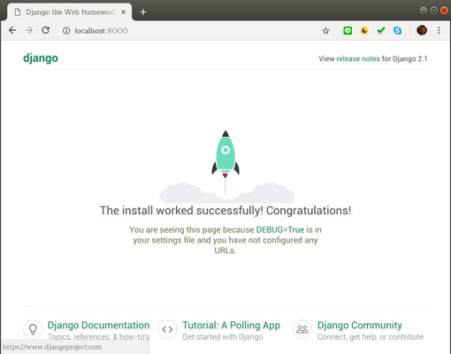
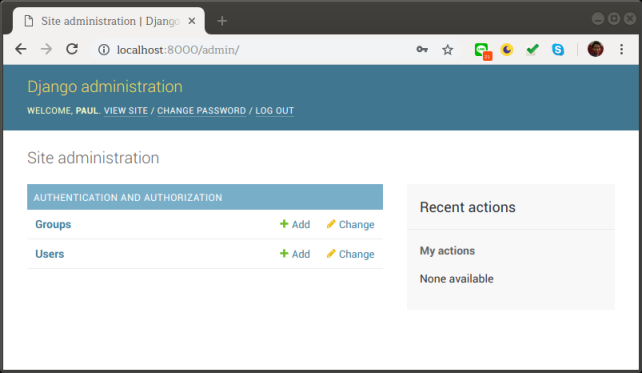
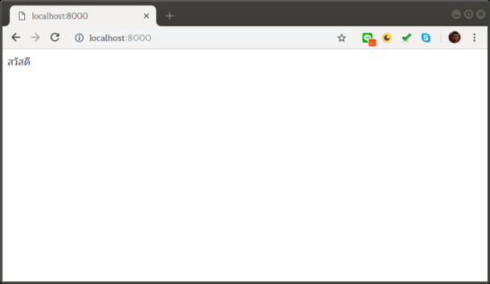

.. toctree::
  :maxdepth: 2
    

Django 2 ตอนที่ 1
=================

pyenv_ เป็นโปรแกรมสำหรับจัดการเวอร์ชันของ Python ที่ช่วยให้สามารถใช้ Python ได้หลายเวอร์ชันในระบบปฏิบัติการเดียว

.. _pyenv: https://github.com/pyenv/pyenv

เพื่อให้สภาพแวดล้อมในการสร้างเว็บเหมือนกันมากที่สุดเท่าที่จะทำได้ จึงขอแนะนำให้ติดตั้ง pyenv ก่อนตามคำสั่งต่อไปนี้

ซอฟต์แวร์ที่ต้องใช้
------------------

1. ติดตั้ง `curl`

.. code-block:: sh

   sudo apt install curl

2. ติดตั้ง `pyenv-installer`

.. code-block:: sh

   curl -L https://github.com/pyenv/pyenv-installer/raw/master/bin/pyenv-installer | bash

3. ติดตั้ง `python 3.7.0`

.. code-block:: sh

  pyenv install 3.7.0
  pyenv global 3.7.0

4. สร้าง virtualenv ชื่อ `djangoenv`

.. code-block:: sh

  pyenv virtualenv djangoenv

5. เปิดใช้งาน `djangoenv`

.. code-block:: sh

  pyenv activate djangoenv

ขั้นตอนการพัฒนาเว็บ
--------------------

1. ติดตั้ง `django`

.. code-block:: sh

  pip install django

2. สร้าง project ในตัวอย่างใช้ชื่อ calendarproject

.. code-block:: sh

  django-admin startproject calendarproject

3. สร้างตารางในฐานข้อมูล 

.. code-block:: sh

  cd calendarproject
  ./manage.py migrate

4. สร้าง admin account

.. code-block:: sh

  ./manage.py createsuperuser

ในขั้นตอนนี้จะต้องกรอก Username, Email และ Password

5. เปิด server ให้บริการ

.. code-block:: sh

  ./manage.py runserver

6. เปิด web browser แล้วไปที่ `http://localhost:8000`

7. หน้าจัดการข้อมูลผู้ใช้งานจะอยู่ที่ `http://localhost:8000/admin`

เมื่อกรอก Username และ Password จากข้อ 4 แล้วจะเป็นหน้าจัดการข้อมูลดังต่อไปนี้

8. สร้าง app ใหม่ใน project ชื่อ `myapp` 

.. code-block:: sh

  ./manage startapp myapp

9. เพิ่ม `myapp` ในไฟล์ `calendarproject/settings.py`

.. code-block:: python

  ##
  # Application definition

  INSTALLED_APPS = [
      'django.contrib.admin',
      'django.contrib.auth',
      'django.contrib.contenttypes',
      'django.contrib.sessions',
      'django.contrib.messages',
      'django.contrib.staticfiles',
      'myapp'
  ]
  ##

10. เพิ่ม path ใน `calendarproject/urls.py`

.. code-block:: python

  from django.contrib import admin
  from django.urls import path
  from myapp import views

  urlpatterns = [
      path('', views.index),
      path('admin/', admin.site.urls),
  ]

11. แก้ไขไฟล์ `myapp/views.py` เป็น

.. code-block:: python

  from django.shortcuts import render
  from django.http import HttpResponse

  def index(req):
      return HttpResponse('สวัสดี')

ซึ่งเมื่อดูที่เว็บจะได้

